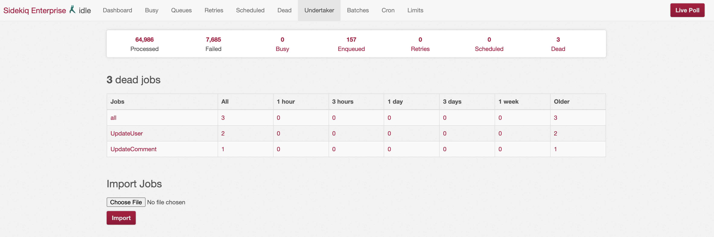
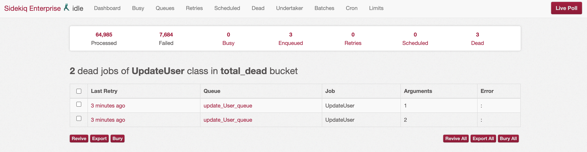
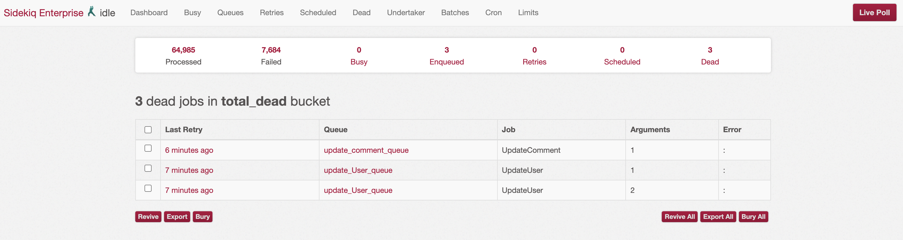

# Sidekiq::Undertaker

[](https://travis-ci.org/ThomasKoppensteiner/sidekiq-undertaker)
[](https://codeclimate.com/github/ThomasKoppensteiner/sidekiq-undertaker)
[](https://codeclimate.com/github/ThomasKoppensteiner/sidekiq-undertaker/test_coverage)

## About

Sidekiq::Undertaker is a plugin for [Sidekiq](https://rubygems.org/gems/sidekiq).
It allows exploring, reviving (retrying) or burying (deleting) dead jobs.
For easy exploring the dead-jobs queue is broken down into time windows (buckets) of hours, days and weeks.

## Installation

#### Install the Gem

Add this line to your application's Gemfile:

````ruby
  gem "sidekiq-undertaker"
````

And then execute:
````sh
  $ bundle
````

Or install it yourself as:

````sh
  $ gem install sidekiq-undertaker
````

#### Install the Rubocop Pre-Commit Hook

````sh
  $ rake rubocop:install
````

## Impressions

#### Filter View

The filter page shows a table with time-buckets as columns and rows for each job class.



#### Job Filter View

For each job class, you can drill down to view error distribution based on
error class.


#### Morgue View
Finally, click on the individual error counts to display details of the
errors in a list form.



The morgue view can, for example, also show an error distribution over all job classes.



## Contributing

1. Fork it ( https://github.com/ThomasKoppensteiner/sidekiq-undertaker/fork )
2. Create your feature branch (`git checkout -b my-new-feature`)
3. Commit your changes (`git commit -am 'Add some feature'`)
4. Push to the branch (`git push origin my-new-feature`)
5. Create new Pull Request

## Naming

As another gem with the name `sidekiq-cleaner` is already released on rubygems.org,
this fork was renamed to `sidekiq-undertaker`.

## Thanks

The [Sidekiq-Cleaner](https://github.com/HackingHabits/sidekiq-cleaner) gem was originally created by [Madan Thangavelu](https://github.com/HackingHabits).
[Tout](https://github.com/Tout/sidekiq-cleaner) and [TheWudu](https://github.com/TheWudu/sidekiq-cleaner) also contributed to it.
For the complete list of network members have a look at the [fork overview](https://github.com/ThomasKoppensteiner/sidekiq-under/network/members).

## Alternative Projects

* [sidekiq-cleaner](https://rubygems.org/gems/sidekiq-cleaner)
* [sidekiq_cleaner](https://rubygems.org/gems/sidekiq_cleaner)

## Author

Thomas Koppensteiner | [Github](https://github.com/ThomasKoppensteiner) | [RubyGems](https://rubygems.org/profiles/thomaskoppensteiner) | [@koppensteiner_t](https://twitter.com/koppensteiner_t)

## License

See the [License](https://github.com/ThomasKoppensteiner/sidekiq-under/blob/master/LICENSE.txt) file.
